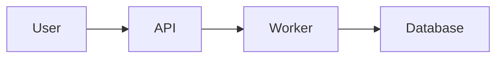
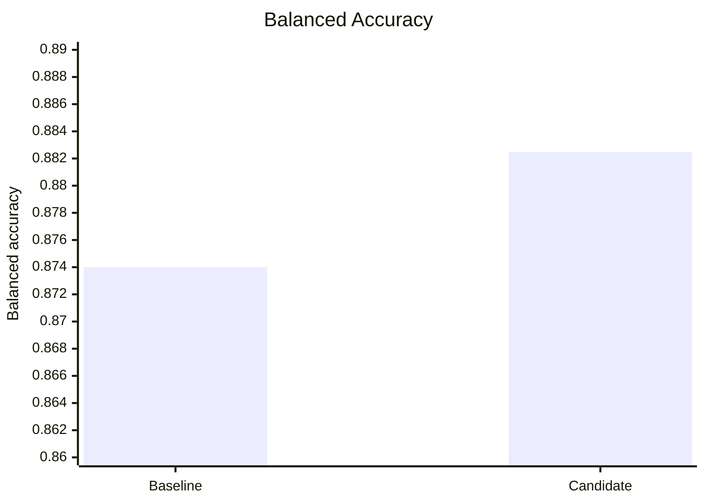
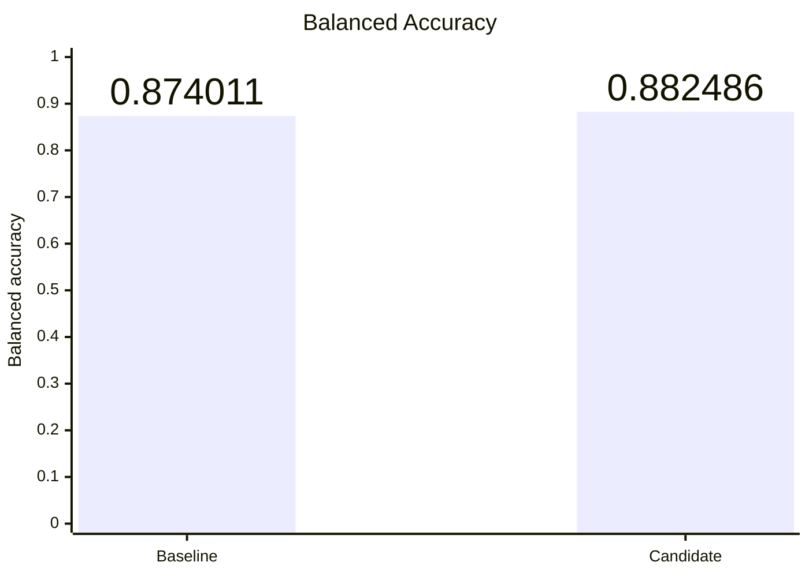
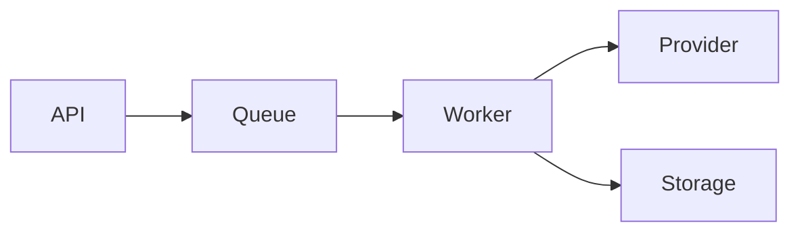

# Mermaid Markdown

## Purpose

Draw the diagram or chart the human actually needs to understand, then implant it directly into the Markdown file where it belongs.

The goal is communication, not completeness.

This is a supporting skill. It visualizes understanding, decisions, relationships, and quantitative results that already exist. It does not perform architecture design, project planning, new statistical analysis, or alternative evaluation.

> Draw the visual the human actually wants to understand.

> The simplest visual that communicates that clearly is the correct visual.

---

# When To Use

Use this skill when the user explicitly wants a Mermaid diagram or Mermaid chart added to or updated in a Markdown file.

Examples:

- "Add an architecture diagram to this task."
- "Put the worker flow into `docs/architecture.md`."
- "Add a Mermaid diagram showing how this request works."
- "Diagram the job lifecycle in this plan."
- "Add a chart comparing the benchmark results."
- "Show these evaluation scores as a Mermaid chart."
- "Plot the before vs after metrics."
- "Update the diagram in this Markdown."
- "Add a diagram here."

The normal output is a Mermaid fenced block directly inside the target `.md` file:

````markdown

````

Do not create a separate `.mmd`, `.svg`, image, or `diagrams/` artifact unless the user explicitly asks for one.

---

# Boundary: Visualize, Do Not Design Or Reinterpret

This skill runs after the relevant system, workflow, plan, or quantitative result is understood well enough to visualize.

It may inspect relevant tasks, docs, plans, repository files, experiment outputs, benchmark results, or implementation evidence to understand what should be drawn.

It must not use visualization as an excuse to redesign the underlying system or reinterpret the underlying results.

Do not:

- choose a new architecture;
- reopen settled architecture decisions;
- evaluate competing implementation approaches;
- invent missing system behavior;
- change responsibilities or boundaries merely to improve the diagram;
- perform new statistical analysis that the source material does not support;
- change, normalize, aggregate, or selectively omit quantitative results merely to make a chart look better;
- invent statistical significance, confidence, or causality;
- expand into general planning.

If the source material reveals a material contradiction, missing relationship, unclear value, or ambiguous quantitative comparison, surface it instead of silently resolving it in the visual.

A diagram or chart must not look more certain than the evidence behind it.

---

# Clarify The Intended Visual When Needed

A request for "a diagram", "a chart", or "plot these results" may have several valid interpretations.

The skill's first responsibility is therefore to understand:

> **What should the human be able to see immediately from this visual?**

For structural diagrams, that may be:

- the overall architecture;
- an end-to-end process flow;
- a request or job sequence;
- a state lifecycle;
- a deployment view;
- a data flow;
- a specific subsystem.

For quantitative results, that may be:

- which result is largest or smallest;
- which model wins;
- how much something improved;
- whether a candidate beat a baseline;
- how values changed over time;
- whether a target was met;
- the exact absolute values;
- the size and direction of a regression.

Infer this from the request and surrounding Markdown when it is obvious.

Do not ask the user to choose Mermaid syntax or chart type when the skill can choose it.

If two materially different visual messages are plausible and the surrounding context does not resolve them, ask one concise question about the intended comparison.

Good:

> "Do you want this to emphasize the absolute before/after scores, or how much each metric changed?"

> "Should the reader mainly see which model wins, or the trade-off between accuracy and latency?"

Bad:

> "Do you want a bar chart or a line chart?"

The human decides what they want to understand.

The skill decides how Mermaid should express it.

## Clarification rules

- Ask only when the unresolved ambiguity could materially change the visual.
- Ask one useful question at a time.
- Ask about the intended message, not Mermaid syntax.
- Do not turn diagram clarification into a planning session.
- Infer obvious intent instead of asking unnecessary questions.
- Stop asking once there is enough information to draw the intended visual.

Also clarify the target Markdown file when the destination is genuinely unknown.

---

# Ground The Visual

Before drawing, inspect enough relevant source material to represent the subject accurately.

Prefer existing truth such as:

- the target Markdown file;
- approved plans;
- current task files;
- architecture or design docs;
- relevant implementation files;
- benchmark or evaluation outputs;
- experiment summaries;
- tables containing the source values;
- existing diagrams that the new visual must remain consistent with.

Use only as much investigation as is needed for the requested visual.

This is a lightweight supporting task, not an exhaustive repository audit or statistical investigation.

Do not represent an uncertain edge, component, state, interaction, value, or comparison as established fact.

For quantitative charts:

- preserve the source values and units unless the surrounding material explicitly defines a transformation;
- distinguish observed values from derived values;
- when deriving a simple comparison such as `after - before`, make the derivation obvious;
- do not silently round values in calculations before deriving differences;
- use sensible display precision separately from calculation precision.

---

# Choose The Diagram Type By Intent

Prefer Mermaid's simplest suitable diagram type.

## `flowchart`

Use for:

- system/component relationships;
- architecture overviews;
- data flow;
- process/workflow progression;
- deployment shape;
- dependency relationships.

Use `subgraph` when meaningful boundaries or groups improve understanding.

For structural diagrams, arrows represent relationships, dependencies, calls, or data movement as labelled.

For process flowcharts, arrows may represent progression through the process.

## `sequenceDiagram`

Use when the important question is:

> Who interacts with whom, in what order?

Good for:

- request handling;
- async job execution;
- authentication flows;
- callbacks/webhooks;
- retries;
- multi-service interactions.

Use Mermaid constructs such as `alt`, `opt`, `loop`, and responses when they genuinely improve the explanation.

## `stateDiagram-v2`

Use when the important information is lifecycle or allowed state transitions.

Good for:

- jobs;
- sessions;
- subscriptions;
- workflows;
- processing states.

## `xychart` / `xychart-beta`

Use for simple quantitative results when bars or lines communicate the intended comparison more clearly than prose, tables, or nodes and arrows.

Good for:

- comparing one metric across categories;
- benchmark or evaluation results;
- rankings or relative magnitude;
- counts, rates, scores, latency, cost, throughput, or similar numeric outcomes;
- simple ordered progression;
- time-based trends;
- before/after changes;
- candidate versus baseline;
- measured result versus a meaningful target.

Prefer the XY chart syntax already known to work in the target renderer. Use current `xychart` syntax where supported; `xychart-beta` is acceptable when that is the syntax known to render correctly in the environment.

Do not mechanically turn a numeric table into bars.

The chart structure must match the structure of the comparison in the data.

---

# Quantitative Chart Decision Process

Before writing Mermaid syntax, determine the comparison the reader needs to see.

Use this decision process.

## Absolute categorical comparison

Question:

> Which category has the larger or smaller value?

Usually use a bar chart.

Examples:

- throughput by model;
- cost by provider;
- failures by category;
- accuracy across independent models.

Use one category per actual category.

Do not encode a second comparison dimension inside category names when that dimension should be structural.

## Ranking

Question:

> Which results are best or worst?

Usually use a bar chart ordered by value.

Preserve natural order instead when the categories themselves form a meaningful sequence.

## Ordered progression or time trend

Question:

> How does the value change as the x-axis progresses?

Usually use a line chart.

Examples:

- latency across releases;
- accuracy by training step;
- requests over time;
- performance by increasing input size.

Do not use a line merely to connect unrelated categories.

## Single before-versus-after or baseline-versus-candidate comparison

First identify what matters.

If the important question is the exact absolute result:

- a two-bar zero-based chart is acceptable;
- show value labels when supported;
- use readable precision.

If the important question is the movement from one state to another:

- prefer a two-point line or direct change representation;
- a narrower y-axis may be appropriate for the line if it remains honest;
- label the points when supported.

If the important question is the magnitude of improvement or regression:

- plot the delta directly;
- preserve the absolute values in surrounding Markdown or a table when they matter.

Do not force nearly identical absolute bars to look different by truncating the bar axis.

## Multiple paired before-versus-after or baseline-versus-candidate metrics

Treat the values as paired observations.

Do not flatten the pairs into a long alternating category axis.

Bad:

```text
["BA before", "BA after", "MCC before", "MCC after", "AUC before", "AUC after", ...]
```

This makes the reader mentally reconstruct each pair.

Also avoid:

```text
["BA baseline", "BA candidate", "F1 baseline", "F1 candidate", ...]
```

Repeated qualifiers such as `before`, `after`, `baseline`, `candidate`, `control`, and `treatment` are usually comparison dimensions, not category names.

Instead, decide what should be visible.

If the reader mainly needs to see **how much each metric changed**:

- use one category per metric;
- plot `after - before` or `candidate - baseline`;
- label the axis with the natural change unit;
- make the direction of improvement clear when lower values are better.

If the reader mainly needs the **absolute pairs**:

- keep the exact pairs in a Markdown table;
- use separate simple charts when necessary;
- do not fake grouped bars if the Mermaid renderer cannot express them clearly.

If the metrics have incompatible units, ranges, or meanings:

- do not combine them merely because they came from the same experiment;
- use separate charts or a table.

## Target-versus-actual

When the result and target share a compatible scale, a bar series with a meaningful reference line may be useful.

Do not add a target line merely for decoration.

## Trade-offs between different metrics

If the important question is a relationship such as accuracy versus latency, cost versus quality, or recall versus precision across many observations, Mermaid XY charts may not be the right visualization.

Do not force a bar or line chart when the intended comparison requires a scatter plot, uncertainty interval, distribution plot, or other unsupported analytical view.

Use a more suitable visualization format instead.

---

# Quantitative Chart Design

A quantitative chart should make the important comparison easier to see without distorting the underlying results.

## Choose the encoding by the question

Use bars when the reader needs to compare magnitude across discrete categories.

Use lines when the reader needs to understand progression, movement, or trend across an ordered x-axis.

Use a delta when the reader primarily cares about improvement, regression, or gap rather than the original absolute values.

A table may be better when exact individual values matter more than visual comparison.

Two simple charts may be better than one overloaded chart when the results answer different questions.

## Preserve truthful scale

### Bars

Bar length normally encodes magnitude, so a zero-based quantitative axis is the default when the chart is intended to communicate absolute magnitude.

However, a non-zero lower bound may be appropriate when the chart is explicitly intended as a **zoomed comparison of close values** rather than an absolute-magnitude view.

Use a zoomed bar axis only when all of the following are true:

- the values are close enough that a zero-based scale hides the comparison the reader actually cares about;
- the metric has a clear, bounded, or otherwise well-understood scale;
- the purpose is to compare differences between values, not imply their absolute magnitudes;
- the y-axis bounds are explicit and easy to read;
- exact values are shown through data labels or nearby Markdown when they materially help interpretation;
- the tighter range does not create a false impression about the practical importance of the difference.

Example:



This can be appropriate when the intended question is:

> Which of these already-high balanced-accuracy results is better?

It would be inappropriate if the chart were being used to imply that the candidate is dramatically larger in absolute magnitude.

Do not truncate a bar axis automatically merely because the bars look similar.

Before changing the axis, decide whether the reader needs:

- absolute magnitude → prefer a zero-based bar;
- close-value comparison → a clearly zoomed bar may be appropriate;
- movement or progression → consider a line;
- magnitude of improvement or regression → consider plotting the delta directly.

### Lines

Line charts do not need to start at zero.

Choose a y-axis range that makes the relevant variation readable while preserving an honest impression of the change.

A narrower range can be appropriate for:

- paired measurements;
- naturally restricted metrics;
- small but meaningful changes;
- time series where the absolute zero is not the relevant reference.

Do not choose axis limits merely to exaggerate an improvement or regression.

When a truncated line axis could surprise the reader, make the axis bounds obvious.

## Close values and small changes

When values are close, do not mechanically accept an unreadable zero-based chart and do not mechanically zoom the axis either.

First identify what the reader should notice.

If the reader needs the **absolute magnitude**:

- keep a zero-based bar scale;
- show exact values when useful;
- accept that genuinely close values should look close.

If the reader needs to **distinguish close results**:

- a clearly bounded zoomed y-axis may be appropriate;
- show the bounds explicitly;
- prefer data labels or nearby exact values;
- choose enough surrounding range that the chart remains readable rather than cropping tightly to the exact minimum and maximum.

If the reader needs to understand **movement**:

- consider a two-point line for an ordered before/after or baseline/candidate comparison;
- use a narrower y-axis when appropriate.

If the reader needs the **size of the change**:

- consider plotting the delta directly;
- preserve the original absolute values in surrounding Markdown when needed for context.

Example source values:

Baseline balanced accuracy:

`0.874011`

Candidate balanced accuracy:

`0.882486`

Possible presentations serve different questions:

- `0 --> 1` bars → accurately emphasize that both scores are high and close;
- `0.86 --> 0.89` bars → emphasize the difference between two close high scores;
- a two-point line → emphasize movement from baseline to candidate;
- `+0.008475` or `+0.85 pp` → emphasize the magnitude of improvement.

Choose among them according to the intended message.

Do not use axis limits merely to make a result look more impressive. Use them to make the relevant comparison legible.

---

# Mermaid XY Chart Features

Use Mermaid's native capabilities when they materially improve comprehension.

## Bar value labels

When exact bar values are useful and the target renderer supports Mermaid 11.14 or newer, enable data labels.

Example:

````markdown

````

`showDataLabel: true` displays the numeric bar values.

`showDataLabelOutsideBar: true` places them outside the bars when that is more readable.

Do not claim Mermaid cannot display bar values when these features are available in the target renderer.

If the renderer version is unknown, prefer syntax already demonstrated to work in that environment or keep the chart readable without relying on the feature.

## Line point labels

In Mermaid versions that support per-point line labels, use them when they clarify important exact values, milestones, or named observations.

Example:

```mermaid
xychart
    x-axis ["Baseline", "Candidate"]
    y-axis "Balanced accuracy" 0.87 --> 0.885
    line [0.874011 "0.874", 0.882486 "0.882"]
```

Use point labels selectively.

Do not label every point in a dense line chart if doing so creates clutter.

## Explicit axis limits

Mermaid permits explicit quantitative axis limits:

```text
y-axis "Balanced accuracy" 0 --> 1
```

or:

```text
y-axis "Balanced accuracy" 0.86 --> 0.89
```

Treat axis limits as a communication decision, not boilerplate.

Do not default every score-like metric to its full theoretical range when that makes the relevant comparison unreadable.

Do not default to a tight range merely because it makes the visual more dramatic.

Choose the range according to:

- what comparison the reader needs to make;
- whether the encoding is a bar or line;
- the natural or bounded range of the metric;
- the observed values;
- the amount of useful visual separation;
- the risk of exaggerating the practical size of the difference.

For a close-value comparison, leave reasonable visual headroom around the observed values rather than setting the lower and upper bounds exactly to the minimum and maximum.

When a non-zero bar baseline is used, the chart should be understandable as a zoomed comparison rather than an absolute-magnitude view.

## Horizontal orientation

Use horizontal XY charts when category labels are long or when horizontal comparison reads more naturally.

Do not rotate or compress labels aggressively when a horizontal layout would communicate more clearly.

## Renderer-dependent features

Keep newer Mermaid conveniences optional unless the target environment is known to support them.

Examples include:

- bar data labels;
- outside-bar data labels;
- line point labels;
- legends for named series;
- label rotation.

Prefer a chart that remains understandable without fragile styling or version-dependent behavior.

---

# Precision And Numeric Presentation

Source precision and display precision are different concerns.

Calculate using the source values.

Display only as much precision as materially helps interpretation.

Prefer readable forms such as:

- `87.40%` instead of `0.874011` when percentage form is clearer;
- `+0.85 pp` for a change from `87.40%` to `88.25%`;
- `243 ms` instead of `242.817391 ms` when sub-millisecond precision is not meaningful;
- `$12.4k` instead of `$12,417.3821` when exact cents are irrelevant.

Do not hide a meaningful small difference through excessive rounding.

Do not display six decimal places merely because the source contains six decimal places.

Keep units consistent across a chart.

For percentages, distinguish carefully between:

- percentage values;
- proportions;
- percentage-point changes;
- relative percentage changes.

Do not label a percentage-point difference as a percent improvement unless that is actually what was calculated.

---

# Ordering

Order categories intentionally.

When ranking or relative magnitude is the point, sort ordinary categories by value when that makes comparison easier.

Preserve natural ordering when the categories have inherent meaning, for example:

- chronological order;
- release progression;
- severity levels;
- ordered experiment settings;
- increasing thresholds;
- increasing input sizes.

Do not sort categories mechanically when doing so would destroy the meaning of the sequence.

For before/after or baseline/candidate data, preserve the semantic direction:

`Before → After`

`Baseline → Candidate`

not the reverse unless the context requires it.

---

# Labels, Titles, And Units

Use a title that states what the chart is about.

Do not stuff exact data values into the title merely because the bars or points are unlabeled.

Poor:

```text
Balanced Accuracy: Baseline 0.874011 vs Candidate 0.882486
```

Better:

```text
Balanced Accuracy: Baseline vs Candidate
```

Then show the values through:

- data labels;
- point labels;
- surrounding Markdown;
- a compact table;
- or the chart itself where appropriate.

Label the quantitative axis and include units when they are not obvious.

Examples:

- `Accuracy (%)`
- `Latency (ms)`
- `Cost (USD)`
- `Throughput (req/s)`
- `Change (percentage points)`
- `Score difference`

Keep category labels concise.

Do not encode exact numeric values inside category labels merely because the chart otherwise lacks labels.

Poor:

```text
["Baseline: 0.874011", "Candidate: 0.882486"]
```

Better:

```text
["Baseline", "Candidate"]
```

and display the values through proper data labels or surrounding context.

---

# Showcase The Result, Not The Dataset

When the chart is intended to communicate experiment, benchmark, evaluation, or business results, identify the main quantitative finding first.

The chart should make that finding visually obvious.

Examples:

- improvement across several metrics → chart the change by metric;
- winner among models → rank models by the important metric;
- performance across releases → show the ordered trend;
- latency against an SLA → show measurements against the SLA;
- exact before/after numbers → pair them clearly or retain them in a table;
- trade-off between independent metrics → use a more suitable visualization if Mermaid cannot express it well.

Do not reproduce every available number merely because it exists.

Do not choose a chart solely because it is easy to encode in Mermaid.

The intended comparison determines the chart.

---

# One Diagram, One Main Question

Every diagram or chart should have an obvious reason to exist.

Avoid combining several independent questions into one canvas.

Split a visual when:

- it has multiple competing reading paths;
- relationships become hard to trace;
- unrelated abstraction levels are mixed;
- too many categories or series materially hurt comprehension;
- several metrics use incompatible scales;
- it is answering more than one important question.

Do not split merely because a fixed node or data-point count has been exceeded.

---

# Use The Right Abstraction

Show what matters for the question being answered.

Usually include:

- major components;
- major relationships;
- meaningful boundaries;
- important data or control movement;
- relevant decisions or states;
- quantitative results that directly support the comparison being shown.

Usually exclude:

- every source file;
- every class;
- every helper function;
- every API endpoint;
- configuration trivia;
- implementation detail that does not improve the reader's mental model;
- quantitative columns or categories that do not help answer the chart's main question.

Do not mix abstraction levels without a good reason.

---

# Make The Reading Path Obvious

Choose diagram direction intentionally.

Typical defaults:

- `LR` for pipelines, dependencies, and horizontal flows;
- `TD`/`TB` when hierarchy or vertical progression reads more naturally;
- vertical XY charts for short categorical comparisons;
- horizontal XY charts when category labels are long.

Prefer layouts where the main path or comparison is visually easy to follow.

Avoid unnecessary edge crossings.

Use subgraphs and ordering to reflect real conceptual grouping rather than merely making the diagram symmetrical.

---

# Labels

Use human-readable names.

Prefer:

- `Video Worker`
- `Job Queue`
- `Supabase`
- `Blob Storage`

over implementation identifiers such as:

- `VideoGenerationOrchestratorServiceV2`
- `supabase_prod_db_01`

Use implementation names only when those names are themselves important to the reader.

Keep node and chart labels concise.

Edge labels should explain the relationship or payload when that information matters.

Prefer:

```text
API -->|enqueue job| Queue
Worker -->|store result| Blob
```

over long sentences on the canvas.

For charts, prefer labels that describe the actual metric or category rather than internal variable names.

---

# Visual Language

Prefer Mermaid's normal visual language and minimal styling.

Do not invent elaborate house conventions for:

- colors;
- line thickness;
- arrow styles;
- custom shapes.

If a visual distinction carries meaning, make that meaning obvious and use it consistently.

Prefer explicit labels and the semantics of the chosen Mermaid diagram type over relying on subtle styling.

Do not rely on color alone to communicate an important distinction.

The diagram should remain understandable in different themes and renderers.

---

# Markdown Integration

The Markdown document is the normal source of truth for the visual.

Insert the Mermaid block where it provides the most useful context rather than simply appending it to the end of the file.

Preserve the document's:

- heading structure;
- writing style;
- terminology;
- existing organization.

A diagram may be preceded or followed by a short sentence when that materially helps the reader understand its purpose.

For quantitative charts, keep necessary interpretation or methodological context in normal Markdown rather than overloading the chart itself.

When exact values matter more than the visual comparison alone can communicate, a small table adjacent to the chart is acceptable.

Do not add verbose explanation merely because a diagram was inserted.

---

# Accessibility

For non-trivial structural diagrams, add a concise accessible title and description when supported by the Mermaid syntax being used.

Example:



The description should summarize the information conveyed by the diagram, not reproduce every node and edge.

For quantitative charts:

- do not depend on color alone;
- make titles, axis labels, units, ordering, and surrounding Markdown sufficient to understand the result;
- show exact values when they materially improve accessibility or interpretation.

---

# Validation

Before finishing any visual:

1. Check that the Mermaid syntax is internally consistent.
2. Check that the visual matches the underlying source material.
3. Check that the chosen diagram type matches the question being answered.
4. Check that the main reading path or quantitative comparison is obvious.
5. Remove information that does not improve understanding.
6. Confirm the visual was inserted into the intended Markdown file and location.

For quantitative charts, additionally check:

1. What comparison should the reader notice first?
2. Does the chosen encoding expose that comparison directly?
3. Are paired values still visibly paired?
4. Have comparison dimensions such as `before`, `after`, `baseline`, or `candidate` been incorrectly flattened into category names?
5. Would a delta, ranking, trend, reference line, table, or separate charts communicate the result more clearly?
6. Can the reader understand the main result without mentally matching distant bars or labels?
7. Do plotted values and units match the source?
8. Is display precision appropriate?
9. For bars, is the axis choice appropriate to the intent: zero-based for magnitude, or clearly zoomed for deliberate close-value comparison?
10. If a non-zero bar baseline is used, are the bounds explicit, justified by the comparison, and unlikely to imply a misleading effect size?
11. For lines with a truncated axis, is the chosen range honest and clearly readable?
12. Is category ordering intentional?
13. Are axis labels and units clear?
14. Are exact values shown when they materially help?
15. Is the chart still readable in the target Mermaid renderer?

If the repository already has a Mermaid validation or rendering command, it may be used.

Do not install Mermaid CLI or create a rendering pipeline solely for this skill.

Native Markdown Mermaid rendering is the normal workflow.

When using newer Mermaid features, prefer syntax already known to render correctly in the target environment.

---

# Quality Bar

A successful diagram lets the reader quickly answer the question it was created for.

The reader should be able to tell:

- what they are looking at;
- where to start;
- what the important elements are;
- how those elements relate;
- what the main flow, structure, comparison, or trend is.

For a quantitative chart, the reader should also be able to tell:

- what is being measured;
- what the units are;
- what is being compared;
- whether ordering is meaningful;
- which result or trend matters;
- whether higher or lower values are preferable when that is not obvious;
- the important exact values when precision matters;
- whether the chart is showing absolute values, change, or both.

The visual should not require chat history to decode it.

If the result is technically valid but the reader still has to mentally reconstruct the intended comparison, redesign it.

If the result looks impressive but the reader cannot quickly form the intended mental model, simplify it.

---

# Non-Goals

This skill is not responsible for:

- architecture design;
- project planning;
- requirements discovery beyond visual intent;
- alternative evaluation;
- implementation decisions;
- performing new statistical analysis;
- inventing statistical significance or causality;
- changing or selectively presenting results to strengthen a narrative;
- exhaustive repository analysis;
- advanced data visualization;
- opportunistically diagramming unrelated work;
- maintaining a standalone diagram library;
- generating SVG or image derivatives;
- installing Mermaid tooling;
- elaborate visual design systems.

Mermaid XY charts are intended here for lightweight, documentation-native quantitative visualization.

If the result requires features Mermaid does not express clearly, such as:

- confidence intervals;
- error bars;
- logarithmic scales;
- box plots;
- distributions;
- complex grouped or stacked comparisons;
- dense datasets;
- several incompatible axes;
- advanced statistical annotation;

use a more suitable visualization format instead of forcing the result into Mermaid.

It is a small supporting skill:

> understand what the human needs to see → ground it in existing truth → choose the right visual encoding → draw the clearest useful Mermaid diagram or chart → insert it into the desired Markdown.
