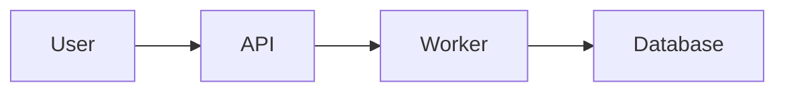
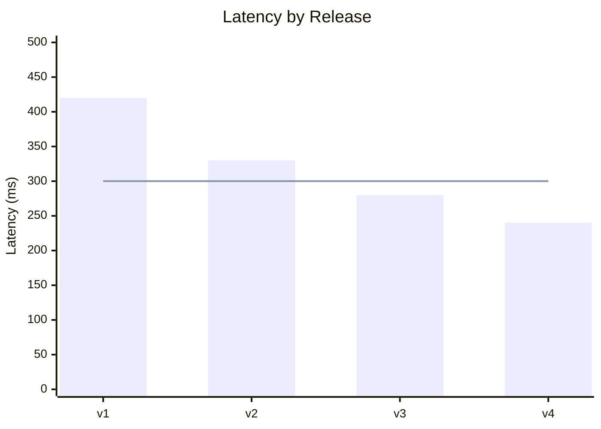
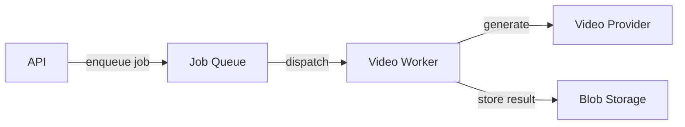
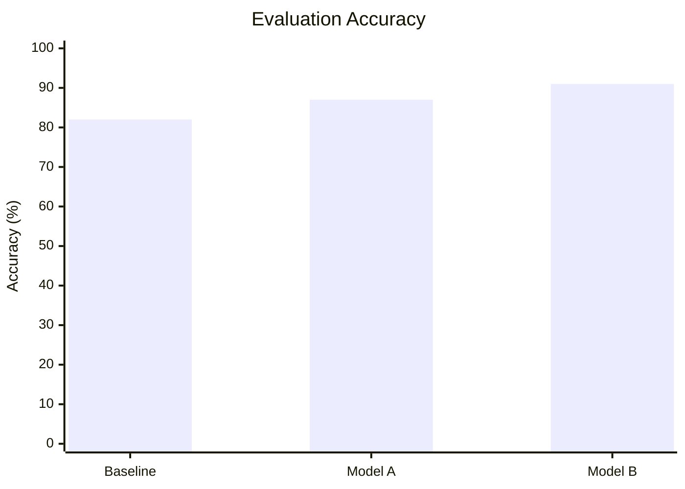
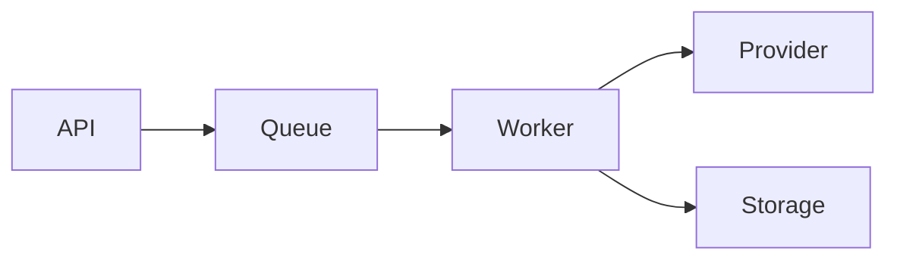

# Mermaid Markdown

## Purpose

Draw the diagram the human actually wants to understand, then implant it directly into the Markdown file where it belongs.

The goal is communication, not completeness.

This is a supporting skill. It visualizes understanding, decisions, relationships, and quantitative results that already exist. It does not perform architecture design, planning, statistical analysis, or alternative evaluation.

> Draw the diagram the human actually wants to understand.

> The simplest diagram that communicates that clearly is the correct diagram.

---

# When To Use

Use this skill when the user explicitly wants a Mermaid diagram added to or updated in a Markdown file.

Examples:

- "Add an architecture diagram to this task."
- "Put the worker flow into `docs/architecture.md`."
- "Add a Mermaid diagram showing how this request works."
- "Diagram the job lifecycle in this plan."
- "Add a chart comparing the benchmark results."
- "Show these evaluation scores as a Mermaid chart."
- "Update the diagram in this Markdown."
- "Add a diagram here."

The normal output is a Mermaid fenced block directly inside the target `.md` file:

````markdown

````

Do not create a separate `.mmd`, `.svg`, image, or `diagrams/` artifact unless the user explicitly asks for one.

---

# Boundary: Visualize, Do Not Design

This skill runs after the relevant system, workflow, plan, or quantitative result is understood well enough to visualize.

It may inspect relevant tasks, docs, plans, repository files, experiment outputs, benchmark results, or implementation evidence to understand what should be drawn.

It must not use diagram generation as an excuse to redesign the underlying system or reinterpret the underlying results.

Do not:

- choose a new architecture;
- reopen settled architecture decisions;
- evaluate competing implementation approaches;
- invent missing system behavior;
- change responsibilities or boundaries merely to improve the diagram;
- perform new statistical analysis that the source material does not support;
- change, normalize, aggregate, or selectively omit quantitative results merely to make a chart look better;
- expand into general planning.

If the source material reveals a material contradiction, missing relationship, or unclear quantitative result, surface it instead of silently resolving it in the diagram.

A diagram must not look more certain than the evidence behind it.

---

# Clarify The Diagram When Needed

A request for "a diagram" may have many valid interpretations.

The same material could reasonably have:

- a system/component overview;
- an end-to-end process flow;
- a request or job sequence;
- a state lifecycle;
- a deployment view;
- a data flow;
- a specific subsystem diagram;
- a quantitative comparison;
- a trend chart.

The skill's first responsibility is therefore to understand:

> **What does the human want this diagram to make clear?**

Infer this from the request and surrounding Markdown when it is obvious.

If materially unclear, ask a concise question before drawing.

Examples:

> "What would you like this diagram to make clear: the overall architecture, the end-to-end job flow, or a specific subsystem?"

> "Do you want the component relationships or the runtime sequence?"

> "Should the chart emphasize the ranking between results or the change across runs?"

Also clarify the target Markdown file when the destination is genuinely unknown.

## Clarification rules

- Ask only when the unresolved ambiguity could materially change the diagram.
- Ask one useful question at a time.
- Do not turn diagram clarification into a planning session.
- Do not ask the user to choose Mermaid syntax when the skill can choose it.
- Stop asking once there is enough information to draw the intended diagram.

The human decides what they want to understand.

The skill decides how Mermaid should express it.

---

# Ground The Diagram

Before drawing, inspect enough relevant source material to represent the subject accurately.

Prefer existing truth such as:

- the target Markdown file;
- approved plans;
- current task files;
- architecture or design docs;
- relevant implementation files;
- benchmark or evaluation outputs;
- experiment summaries;
- existing diagrams that the new diagram must remain consistent with.

Use only as much investigation as is needed for the requested diagram.

This is a lightweight supporting task, not an exhaustive repository audit or statistical investigation.

Do not represent an uncertain edge, component, state, interaction, value, or comparison as established fact.

For quantitative charts, preserve the source values and their units unless the surrounding material explicitly defines a transformation that should be shown.

---

# Choose The Diagram Type By Intent

Prefer Mermaid's simplest suitable diagram type.

## `flowchart`

Use for:

- system/component relationships;
- architecture overviews;
- data flow;
- process/workflow progression;
- deployment shape;
- dependency relationships.

Use `subgraph` when meaningful boundaries or groups improve understanding.

For structural diagrams, arrows represent relationships, dependencies, calls, or data movement as labelled.

For process flowcharts, arrows may represent progression through the process.

## `sequenceDiagram`

Use when the important question is:

> Who interacts with whom, in what order?

Good for:

- request handling;
- async job execution;
- authentication flows;
- callbacks/webhooks;
- retries;
- multi-service interactions.

Use Mermaid constructs such as `alt`, `opt`, `loop`, and responses when they genuinely improve the explanation.

## `stateDiagram-v2`

Use when the important information is lifecycle or allowed state transitions.

Good for:

- jobs;
- sessions;
- subscriptions;
- workflows;
- processing states.

## `xychart-beta`

Use for simple quantitative results when bars or lines communicate the comparison more clearly than prose, tables, or nodes and arrows.

Good for:

- comparing one metric across categories;
- showing benchmark or evaluation results;
- showing rankings or relative magnitude;
- comparing counts, rates, scores, latency, cost, or other numeric outcomes;
- showing a simple ordered progression;
- showing a time-based trend;
- showing a bar series with a meaningful reference or target line.

Prefer:

- `bar` for categorical comparison, ranking, or magnitude;
- `line` for ordered progression and trends;
- `xychart-beta horizontal` when category labels are long or horizontal comparison is easier to read.

Example:


A bar and line may be combined when they communicate genuinely different information on a compatible scale, for example measured results against a target:



Do not plot the same values as both bars and a line merely for decoration.

Prefer one bar series. Do not use multiple bar series to imitate grouped or stacked bars unless the target Mermaid renderer is known to support the intended result clearly.

Keep advanced renderer-dependent features optional. Legends, data labels, point labels, label rotation, and similar conveniences may depend on the Mermaid version used by the target Markdown renderer.

If the chart requires capabilities Mermaid does not express clearly, use a more appropriate visualization format rather than forcing it into Mermaid.

Examples include:

- confidence intervals or error bars;
- logarithmic scales;
- box plots or distribution plots;
- complex grouped or stacked comparisons;
- dense datasets;
- several metrics with incompatible scales;
- advanced statistical annotation.

## Other Mermaid types

Use more specialized types when they clearly communicate the requested information better, for example:

- `erDiagram` for entity/data relationships;
- `classDiagram` for class or type structure.

Prefer broadly supported Mermaid syntax.

Do not reach for experimental or unusually renderer-dependent syntax unless it offers a material benefit.

---

# Diagram Design

## One Diagram, One Main Question

Every diagram should have an obvious reason to exist.

Avoid combining several independent questions into one canvas.

If a reader has to understand architecture, execution order, deployment, state transitions, and quantitative performance simultaneously, separate them.

Split a diagram when:

- it has multiple competing reading paths;
- relationships become hard to trace;
- unrelated abstraction levels are mixed;
- edge crossings or density materially hurt comprehension;
- it is answering more than one important question.

Do not split merely because a fixed node or data-point count has been exceeded.

---

## Use The Right Abstraction

Show what matters for the question being answered.

Usually include:

- major components;
- major relationships;
- meaningful boundaries;
- important data or control movement;
- relevant decisions or states;
- quantitative results that directly support the comparison being shown.

Usually exclude:

- every source file;
- every class;
- every helper function;
- every API endpoint;
- configuration trivia;
- implementation detail that does not improve the reader's mental model;
- quantitative columns or categories that do not help answer the chart's main question.

Do not mix abstraction levels without a good reason.

---

## Quantitative Chart Design

A quantitative chart should make the important comparison easier to see without distorting the underlying results.

### Choose the encoding by the question

Use bars when the reader needs to compare magnitude across discrete categories.

Use lines when the reader needs to understand progression, trend, or change across an ordered x-axis such as time, release number, experiment step, or increasing input size.

Do not use a line merely to connect unrelated categories.

### Preserve truthful scale

For bar charts, include zero in the quantitative axis range. Bar length represents magnitude, so truncating the axis can exaggerate small differences.

For line charts, choose an axis range that communicates the trend accurately. A non-zero minimum may be appropriate when it improves readability, but it must not create a misleading impression of the size of the change.

Do not manipulate axis limits merely to make an improvement or regression look more dramatic.

### Order categories intentionally

When ranking or relative magnitude is the point, order ordinary categories by value when that makes comparison easier.

Preserve natural ordering when the categories have inherent meaning, for example:

- chronological order;
- model or release progression;
- severity levels;
- ordered experiment settings;
- increasing thresholds or input sizes.

Do not sort categories mechanically when doing so would destroy the meaning of the sequence.

### Make units and meaning obvious

Use a clear chart title when the surrounding heading does not already explain the chart.

Label the quantitative axis and include units when they are not obvious.

Examples:

- `Accuracy (%)`
- `Latency (ms)`
- `Cost (USD)`
- `Throughput (req/s)`
- `Count`

Keep category labels concise and readable.

If an abbreviation is necessary, ensure its meaning is clear from the surrounding Markdown.

### Keep the chart focused

Show only the data needed to answer the chart's main question.

Avoid:

- decorative series;
- redundant encodings;
- unnecessary categories;
- excessive precision;
- visual clutter;
- plotting the same measure in multiple forms without purpose.

A table may be better when exact individual values matter more than visual comparison.

Two simple charts may be better than one overloaded chart when the results answer different questions.

### Preserve context

Do not silently remove context needed to interpret the numbers.

When relevant, keep information such as the following in the surrounding Markdown:

- metric definition;
- dataset or benchmark name;
- sample size;
- evaluation conditions;
- baseline definition;
- whether higher or lower is better;
- source of the measurements;
- important uncertainty or caveats.

The chart should visualize the result, not manufacture confidence that the underlying evidence does not support.

---

## Make The Reading Path Obvious

Choose diagram direction intentionally.

Typical defaults:

- `LR` for pipelines, dependencies, and horizontal flows;
- `TD`/`TB` when hierarchy or vertical progression reads more naturally;
- vertical XY charts for short categorical comparisons;
- horizontal XY charts when category labels are long.

Prefer layouts where the main path or comparison is visually easy to follow.

Avoid unnecessary edge crossings.

Use subgraphs and ordering to reflect real conceptual grouping rather than merely making the diagram symmetrical.

---

## Labels

Use human-readable names.

Prefer:

- `Video Worker`
- `Job Queue`
- `Supabase`
- `Blob Storage`

over implementation identifiers such as:

- `VideoGenerationOrchestratorServiceV2`
- `supabase_prod_db_01`

Use implementation names only when those names are themselves important to the reader.

Keep node and chart labels concise.

Edge labels should explain the relationship or payload when that information matters.

Prefer:

```text
API -->|enqueue job| Queue
Worker -->|store result| Blob
```

over long sentences on the canvas.

For charts, prefer labels that describe the actual metric or category rather than internal variable names.

---

## Visual Language

Prefer Mermaid's normal visual language and minimal styling.

Do not invent elaborate house conventions for:

- colors;
- line thickness;
- arrow styles;
- custom shapes.

If a visual distinction carries meaning, make that meaning obvious and use it consistently.

Prefer explicit labels and the semantics of the chosen Mermaid diagram type over relying on subtle styling.

Do not rely on color alone to communicate an important distinction.

The diagram should remain understandable in different themes and renderers.

---

# Markdown Integration

The Markdown document is the normal source of truth for the diagram.

Insert the Mermaid block where it provides the most useful context rather than simply appending it to the end of the file.

Preserve the document's:

- heading structure;
- writing style;
- terminology;
- existing organization.

A diagram may be preceded or followed by a short sentence when that materially helps the reader understand its purpose.

For quantitative charts, keep necessary interpretation or methodological context in normal Markdown rather than overloading the chart itself.

Do not add verbose explanation merely because a diagram was inserted.

Example:

````markdown
## Job Processing

Generation jobs are processed asynchronously through the worker queue.


````

Quantitative example:

````markdown
## Evaluation Results

Model B achieved the highest accuracy on the evaluation set.


````

---

# Accessibility

For non-trivial diagrams, add a concise accessible title and description when supported by the Mermaid syntax being used.

Example:



The description should summarize the information conveyed by the diagram, not reproduce every node and edge.

For quantitative charts, do not depend on color alone. Titles, axis labels, units, ordering, and surrounding Markdown should make the result understandable.

---

# Validation

Before finishing:

1. Check that the Mermaid syntax is internally consistent.
2. Check that the diagram matches the underlying source material.
3. Check that the chosen diagram type matches the question being answered.
4. Check that the main reading path or quantitative comparison is obvious.
5. Remove information that does not improve understanding.
6. For quantitative charts, confirm that plotted values and units match the source.
7. For bar charts, confirm that the quantitative axis includes zero.
8. Confirm that category ordering is intentional.
9. Confirm that axis labels and units are clear where needed.
10. Confirm that the diagram was inserted into the intended Markdown file and location.

If the repository already has a Mermaid validation or rendering command, it may be used.

Do not install Mermaid CLI or create a rendering pipeline solely for this skill.

Native Markdown Mermaid rendering is the normal workflow.

When using newer Mermaid features, prefer syntax already known to render correctly in the target environment.

---

# Quality Bar

A successful diagram lets the reader quickly answer the question it was created for.

The reader should be able to tell:

- what they are looking at;
- where to start;
- what the important elements are;
- how those elements relate;
- what the main flow, structure, comparison, or trend is.

For a quantitative chart, the reader should also be able to tell:

- what is being measured;
- what the units are;
- what is being compared;
- whether ordering is meaningful;
- which result or trend matters;
- whether higher or lower values are preferable when that is not obvious.

The diagram should not require chat history to decode it.

If the result looks impressive but the reader still cannot quickly form the intended mental model, simplify it.

---

# Non-Goals

This skill is not responsible for:

- architecture design;
- project planning;
- requirements discovery beyond diagram intent;
- alternative evaluation;
- implementation decisions;
- performing new statistical analysis;
- changing or selectively presenting results to strengthen a narrative;
- exhaustive repository analysis;
- advanced data visualization;
- opportunistically diagramming unrelated work;
- maintaining a standalone diagram library;
- generating SVG or image derivatives;
- installing Mermaid tooling;
- elaborate visual design systems.

It is a small supporting skill:

> understand which diagram the human wants → ground it in existing truth → draw the clearest useful Mermaid diagram → insert it into the desired Markdown.
